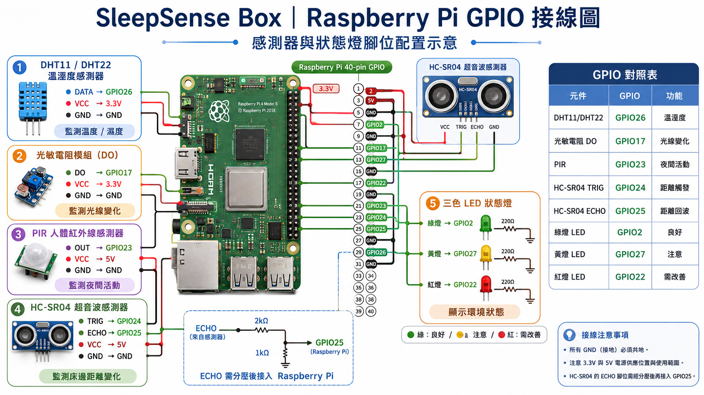

# SleepSense Box

> A Raspberry Pi based IoT side project for monitoring sleep environment conditions and sending daily reports to your phone.

SleepSense Box 是一個以 Raspberry Pi 為核心的睡眠環境監測 Side Project。
它不偵測人體生理資料，而是專注在「房間與床邊環境」：溫度、濕度、光線變化、夜間活動與床邊距離變化。

系統會把感測器資料轉換成每日睡眠環境分數，並自動產生：

* Web Dashboard
* SQLite 歷史紀錄
* PDF 每日報告
* ntfy 手機通知
* LED 即時狀態顯示

---

## Why I Built This

一般智慧手錶多半著重在心率、血氧、睡眠週期等身體資料，但睡眠狀況也可能受到環境影響，例如房間太悶、太潮濕、半夜有光線干擾，或床邊有明顯活動。

SleepSense Box 的目標是補足這一塊：

> 不只知道「睡得怎麼樣」，也想知道「睡眠環境發生了什麼」。

---

## Features

* Collects sleep environment data with Raspberry Pi GPIO
* Detects temperature and humidity with DHT sensor
* Detects night movement with PIR sensor
* Detects light changes with photoresistor digital output
* Detects bedside distance changes with HC-SR04 ultrasonic sensor
* Calculates a 0–100 sleep environment score
* Stores daily records in SQLite
* Provides a Flask web dashboard
* Generates a daily PDF report
* Sends daily summary and PDF to phone via ntfy
* Displays current environment status with green / yellow / red LEDs

---

## Demo Output

SleepSense Box can generate:

* A daily mobile notification
* A PDF report with score, trends, main factors and suggestions
* A dashboard showing latest status and historical records

---

## System Overview

```text
Sensors
DHT / PIR / Photoresistor / HC-SR04
        ↓
Raspberry Pi GPIO
        ↓
Python data collection
        ↓
SQLite database
        ↓
Flask Dashboard / PDF Report / ntfy Notification / LED Status
```

---


插入下面這段：

:::writing{variant="standard" id="17392"}
## GPIO Wiring Diagram

The following diagram shows the Raspberry Pi GPIO wiring used in SleepSense Box.



---
:::

所以更新後順序會變成：

```md
## System Overview

...

---

## GPIO Wiring Diagram

The following diagram shows the Raspberry Pi GPIO wiring used in SleepSense Box.


---

## Hardware

| Component        |           GPIO / Connection | What it monitors      | Purpose                                          |
| ---------------- | --------------------------: | --------------------- | ------------------------------------------------ |
| DHT11 / DHT22    |                      GPIO26 | Temperature, humidity | Detects whether the room is too hot or humid     |
| PIR sensor       |                      GPIO23 | Human movement        | Detects night movement or people walking nearby  |
| Photoresistor DO |                      GPIO17 | Light changes         | Detects light interference during sleep          |
| HC-SR04 Trig     |                      GPIO24 | Ultrasonic trigger    | Sends ultrasonic signal                          |
| HC-SR04 Echo     | GPIO25 with voltage divider | Bedside distance      | Detects movement, leaving bed or bedside changes |
| Green LED        |                       GPIO2 | Status output         | Good sleep environment                           |
| Yellow LED       |                      GPIO27 | Status output         | Needs attention                                  |
| Red LED          |                      GPIO22 | Status output         | Needs improvement                                |

---

## LED Status

| LED    | Score range | Status    | Meaning                                  |
| ------ | ----------: | --------- | ---------------------------------------- |
| Green  |      80–100 | Good      | Environment is stable                    |
| Yellow |       60–79 | Attention | Some factors may affect sleep            |
| Red    |        0–59 | Improve   | Environment interference is more obvious |

The LEDs make the system readable without opening the dashboard.

---

## Event Rules

| Event            | Sensor           | Rule                        | Meaning                     |
| ---------------- | ---------------- | --------------------------- | --------------------------- |
| High temperature | DHT              | `temperature_avg > 28°C`    | Room may be too warm        |
| High humidity    | DHT              | `humidity_avg > 70%`        | Room may be too humid       |
| Night movement   | PIR              | `0 → 1` signal change       | Human movement detected     |
| Light change     | Photoresistor DO | Digital state changed       | Light interference detected |
| Distance change  | HC-SR04          | Distance difference > 20 cm | Bedside activity detected   |

---

## Cooldown Logic

To avoid counting the same movement multiple times, the system uses cooldown settings:

```python
PIR_COOLDOWN_SECONDS = 10
DISTANCE_COOLDOWN_SECONDS = 10
```

This means:

* PIR movement is counted once within 10 seconds.
* HC-SR04 distance change is counted once within 10 seconds.

This helps reduce false repeated events caused by sensor signal staying high or small unstable readings.

---

## Bedside Distance Detection

HC-SR04 is used to monitor distance changes near the bed.

It does not directly determine sleep quality.
Instead, it checks whether the distance in front of the sensor changes significantly.

Possible situations:

* Turning over
* Getting out of bed
* Someone approaching the bedside
* Bedside object movement
* Large body movement near the sensor

If the distance changes by more than 20 cm, the system records one bedside distance event.

---

## Tech Stack

### IoT / Hardware

* Raspberry Pi
* RPi.GPIO
* gpiozero
* DHT sensor
* PIR sensor
* Photoresistor module
* HC-SR04 ultrasonic sensor
* Three-color LED status output

### Backend

* Python
* Flask
* Sensor data processing
* Report generation
* PDF generation

### Database

* SQLite
* Daily sleep environment records

### Frontend

* HTML
* CSS
* JavaScript
* Responsive Dashboard
* Score trend chart
* Daily record table

### Notification

* ntfy
* Mobile push notification
* PDF attachment delivery

---

## Database Schema

Database file:

```text
data/sleepsense.db
```

Main table:

```text
daily_reports
```

| Field                    | Description                      |
| ------------------------ | -------------------------------- |
| `report_date`            | Report date                      |
| `score`                  | Sleep environment score          |
| `temperature_avg`        | Average temperature              |
| `humidity_avg`           | Average humidity                 |
| `pir_motion_events`      | PIR movement event count         |
| `light_events`           | Photoresistor light change count |
| `distance_change_events` | HC-SR04 distance change count    |
| `distance_avg_cm`        | Average measured distance        |
| `distance_min_cm`        | Minimum measured distance        |
| `distance_max_cm`        | Maximum measured distance        |
| `top_causes`             | Main factors affecting the score |
| `message`                | Daily text report                |
| `pdf_path`               | Generated PDF report path        |
| `raw_json`               | Raw sensor data                  |
| `created_at`             | Record creation time             |

---

## Project Structure

```text

```

---

## Installation

Clone the project and enter the folder:

```bash
cd ~/Documents/project/sleepsense-box-dashboard
```

Activate the conda environment:

```bash
conda activate openclaw
```

Install dependencies:

```bash
pip install -r requirements.txt
```

---

## ntfy Setup

Create a `.env` file:

```bash
echo NTFY_TOPIC=sleepsense-tc-2026 > .env
echo NTFY_SERVER=https://ntfy.sh >> .env
```

Change `NTFY_TOPIC` to your own ntfy topic.

---

## Run Daily Report

```bash
chmod +x run_daily_report.sh
./run_daily_report.sh
```

This will:

1. Collect sensor data
2. Generate `reports/sleep_report.json`
3. Save the record into SQLite
4. Generate `outputs/daily_message.txt`
5. Generate `outputs/daily_report.pdf`
6. Send notification and PDF to phone via ntfy

---

## Run Dashboard

```bash
python app.py
```

Open in browser:

```text
http://<raspberry-pi-ip>:5000
```

Dashboard includes:

* Latest sleep environment score
* Temperature
* Humidity
* Night movement
* Light changes
* Distance changes
* Score trend chart
* Latest report
* Daily history table

---

## PDF Report

The generated PDF includes:

* Sleep environment score
* Temperature and humidity
* Night movement count
* Light change count
* Distance change count
* Main factors
* Suggestions
* Recommended content
* Recent data history
* System notes

---

## Mobile Notification

SleepSense Box uses ntfy to send:

* Daily summary
* Sleep environment score
* Recent trend
* Main factors
* Suggestions
* Recommended content
* PDF report attachment

---

## Conclusion

SleepSense Box is a complete IoT side project that connects hardware sensors, backend processing, database storage, dashboard visualization, PDF report generation and mobile notification.

Instead of focusing on body metrics like smart watches, it focuses on the sleep environment itself. By monitoring temperature, humidity, light changes, night movement and bedside distance changes, the system helps users understand what may be affecting their sleep space and provides actionable suggestions for improvement.
